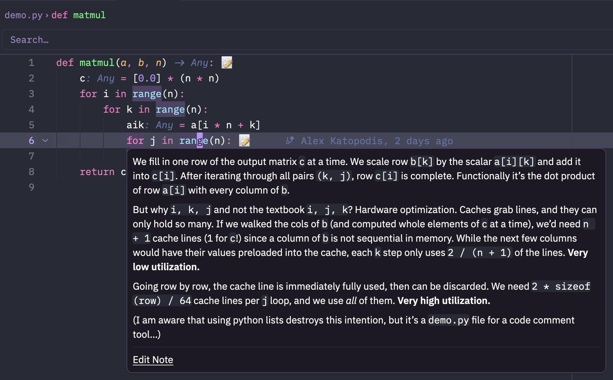

# Zed Sidenotes
If you're anything like me and:
- Read Line A of code.
- Read Line B of code.
- Already sorta forget how Line A works.
- Spend a minute re-deriving your chain of thought around Line A.
- Realize you've now also forgotten how Line B works.

Then this tool might help you. Sidenotes allows you to add/edit/remove notes per line of code. Like this one in `demo.py`:



"Isn't that just an inline comment with extra steps" you'll ask? Yeah... Well kind of. But, if I added an inline comment for every thought I had, no one would let me touch their codebase. These notes can be private to a user, which means they:
- Avoid cluttering the code.
- Don't show up for teammates.
- Can contain content that nobody else would find useful.

## How To Use It
You need [uv](https://docs.astral.sh/uv/) and [rustup](https://rustup.rs) since Zed compiles extensions with it. Then:

1. Clone this repo and install the language server from it. This puts `zed-sidenotes` on your PATH:
   ```sh
   git clone https://github.com/alexkato29/zed-sidenotes
   uv tool install ./zed-sidenotes
   ```
2. In Zed, run `zed: install dev extension` from the command palette and pick the cloned folder.
3. Turn on inlay hints in your Zed settings to see the 📝 marker:
   ```json
   "inlay_hints": { "enabled": true }
   ```

It works in a few languages, but you can always add more in `extension.toml` and reinstall the dev extension. Then:
- **Read a note:** hover a line marked 📝.
- **Add a note:** open code actions on a line and pick **Add sidenote**. Write under the new `@@` line and save.
- **Edit a note:** click **Edit Note** at the bottom of the hover.
- **Delete a note:** open code actions on a line that has a note and pick **Delete sidenote**.

Notes are plain markdown in `.sidenotes/<path to file>.md` with a single block per line of code:

```
@@ for j in range(n):
Whatever you want to remember about this line.
```

Add `.sidenotes/` to your global gitignore to keep notes out of commits. Comments do persist forever, so I use an AI agent to clean up "any comments that reference non-existent lines of code".

## When It Doesn't Work
Because it matches on exact line content, a known limitation does exist: if a line is edited (by you or by someone else via git), the comment link is lost. That's fine since the goal is a minimal tool. Though I do think that this means it's most useful for commenting on code you're reviewing, will not touch for a while, or code where you need a temporary comment.
